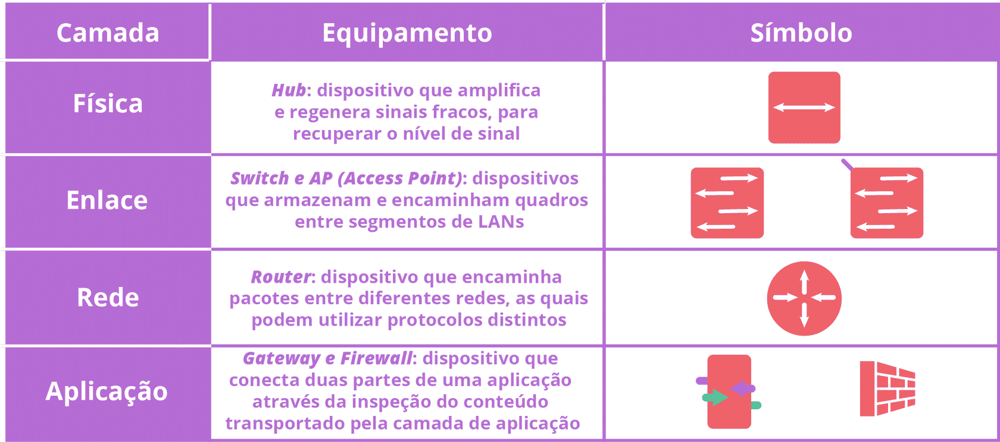
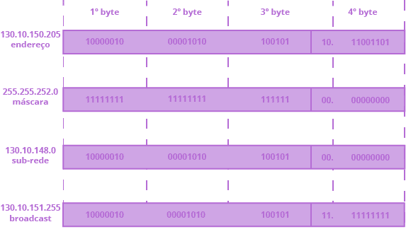
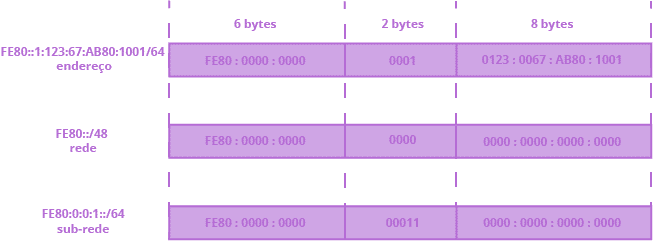

# Web Aula 4

## Camada Física

Tem o objetivo de transmitir os bits enviados pela camada de enlace.
A camada física define a interface mecânica, elétrica e de sincronização para uma rede

Exitem três tipos de **sentidos** de transmissão:

- **Simplex**: Único fluxo;

- **Half-Duplex**: Fluxo de ida e volta, mas não simultâneo;

- **Full-Duplex**: Fluxo de ida e volta simultâneo.

Em relação ao **modo** de transmissão, existem dois tipos:

- **Serial**: Transmissão de um bit por vez em um meio único;

- **Paralelo**: Transmissão de vários bits ao mesmo tempo em vários subcanais num meio.

E por sincronização, temos:

- **Assíncrona**: Os blocos de dados são transmitidos com uma informação de fase para sincronismo entre transmissor e receptor;

- **Síncrona**: Os blocos de dados são transmitidos segundo um relógio de sincronismo compartilhado entre as extremidades.

## Meio Guiado

### Par Trançado

Mais comum entre os meios. Tem dois fios metálicos, com 1mm de espessura.
Existem várias categorias de pares trançados.

- Categoria 3: Dois fios encapados e trançados. Onde 4 pares desse tipo são encapados por plástico. Tem desempenho de 10Mbps.

- Categoria 5: Mesma composição da Categoria 3, mas com desempenho de 100Mbps (Categoria 5) a 1GBps (Categoria 5e).

- Categoria 6: Desempenho de 1GBps.

- Categoria 7: Desempenho de 10GBps.

#### Blindagem

UTP (Unshielded Twisted Pair) x STP (Shielded Twisted Pair)
Blindagem com camada de metal extra para reduzir ruídos eletromagnéticos.

#### Conector Padrão (RJ-45)

**EIA/TIA** (Electronic Industries Alliance/Telecommunications Industry Association) 568A para cabeamento direto e EIA/TIA 568B para o cabeamento cruzado, que é: verde claro, verde escuro, laranja claro, azul escuro, azul claro, laranja escuro, marrom claro, marrom escuro.

## Fibra Óptica

Um sistema de transmissão óptica tem três componentes fundamentais: a fonte de luz, o meio de transmissão e o detector. O sistema de fibra é unidirecional que aceita sinal elétrico, converte e transmite em pulsos de luz, e na saída é reconvertida para o sinal elétrico.

O LED e os lasers condutores são usados para gerar a luz. A fibra óptica é feita de vidro ou plástico, e o detector é um fotodiodo.

Dependendo do diâmetro da fibra, ela é definida como:

- **Monomodo** (SMF – Single-Mode Fiber): Diâmetro de 8 a 10 micrômetros. Transmite apenas um modo de luz por até 80Km;

- **Multimodo** (MMF – Multi-Mode Fiber): Diâmetro de 50 a 62,5 micrômetros. Transmite vários fachos de luz numa distância de até 500m.

Os conectores padrão mais utilizados com os cabos de fibra óptica são o **FC** (Fiber Connector), o **SC** (Subscriber Connector), o **ST** (Straight Tip) e o **E2000**.

## Meio Sem Fio

### Radiofrequência

O princípio se dá por uma antena transmissora de oscilação de elétrons que cria ondas eletromagnéticas e uma antena receptora. A oscilação é dos elétrons por segundo é chamada de **frequência** em Hz (hertz).

O espectro eletromagnético compoem todas as frequências utilizadas. Esse espectro é gerenciado pela **ITU-R** (International Telecommunications Union)

A quantidade de bits varia de alguns bits por Hz em frequências baixas (Gbps em par trançado / cabo coaxial) e 8 bits por Hz em frequências altas (Tbps em fibra).

Porém, em baixas frequências, as ondas atravessam obstáculos e altas não (sendo até absorvidas pela umidade).

As antenas convencionais são onidirecionais (para todas as direções), e as antenas direcionais concentram a onda (irradiação) em uma direção.

# Web Aula 5

## Camada de Enlace

Responsável por criar um canal de comunicação livre de erros entre dois nós adjacentes de uma rede.
Tem objetivvo de transmitir os quadros com os dados enviados pela camada de rede definindo seu formato e ações de envio e recebimento. Protocolo do enlace e física está implementado nas placas de redes.

Funcionalidades que o protocolo da camada tem:

- **Entrega confiável**: Garantir que os dados enviados cheguem ao destino sem erros, com confirmação de recebimento e pedido de retransmissão;

- **Detecção de erros**: bits redundantes de verificação de erros;

- **Retransmissão de quadros**: caso ocorra algum erro, o quadro é reenviado;

- **Controle de fluxo**: controle de envio de quadros para evitar que o receptor fique sobrecarregado;

- **Enquadramento de dados**: define os campos da estrutura do quadro utilizado para encapsular o pacote de dados da camada de rede;

- **Acesso ao meio físico**: especifica a estrutura do quadro e as regras do protocolo de acesso ao meio físico utilizado na transmissão.

### Transmissão de Quadros

Erros comuns são prevenidos com redundância de bits. A forma mais simples é através de um **bit de paridade**, que é um bit que indica se o número de bits 1 é par ou ímpar.

Outra técnica é a **soma de verificação**: soma os bytes e o resultado complemento de 1 é enviado junto com o dado. O receptor faz a soma e verifica se o resultado é 0.

Por fim existe o **CRC** (Cyclic Redundancy Check), método polinomial, onde o transmissor e receptor concordam em relação ao polinômio gerador anteriormente. Na internet, os dois principais polinômios geradores são:

```
GCRC-16 = 11000000000000101

GCRC-32 = 100000100110000010001110110110111
```

O método baseia-se em escolher r bits adicionais, R, e os anexar a um dado D de comprimento d de modo que o padrão de d bits concatenados com os r bits resultantes seja divisível exatamente por GCRC.

Portanto, para o cálculo do CRC é preciso calcular o resto da divisão R tal que (D.2^r) xor R seja divisível por GCRC

### Tipos de Enlaces

- **Ponto a ponto**: Terminação de um enlace enviando bits à outra terminação. O **PPP** (Point-to-Point Protocol) é o protocolo que se destaca.

- **Difusão**: Vários emissores e receptores conectam-se a um mesmo, único e compartilhado canal de comunicação. O enlace gerencia o acesso ao meio de transmissão, pela recepção de quadros ao mesmo tempo. Os quadros envolvidos na colisão são perdidos e o canal de difusão é desperdiçado durante o intervalo da colisão.

Em difusão, todos os dispositivos conectados recebem os pacotes emitidos, porém são descartados caso o endereço enviado junto ao pacote não seja o seu. Caso seja, o pacote é extraído e passado para o protocolo da camada de rede.

**Endereço Físico** ou **Endereço MAC** (Media Access Control) é o identificador de cada dispositivo conectado a uma rede. É um endereço único e inalterável, e é composto por 6 bytes (48 bits). O IEEE gerencia e distribui esses endereços mundialmente. É montado com os 3 primeiros bytes da IEEE e os últimos escolhidos pelo fabricante.

### Padrão IEEE 802

É uma ONG formada por engenheiros para definição de padrões de formatos e protocolos de comunicação entre computadores e dispositivos eletrônicos.

O conjuntos IEEE 802 tem como objetivo definir os padrões das camadas físicas e de enlace para LANs, por datagramas.

São diferentes na camada física e na subcamada MAC do enlace, mas pelo **LLC** (Logical Link Control) são compatíveis.

O **IEEE 802.3 (Ethernet)**, fornece um serviço sem conexão e não confiável à camada de rede.

A Ethernet é uma LAN **CSMA/CD (Carrier Sense Multiple Access/Collision Detection)**, detecta quando for possível a transmissão de dados, no barramento de difusão. Caso houver colisão, os dispositivos esperam um tempo aleatório para retransmitir.

Formato do Quadro IEEE 802.3:

- Destino: 6 bytes - MAC destino
- Origem: 6 bytes - MAC destino
- Tipo: 2 bytes - Que tpo de protocolo pertence os dados enviados
- Comprimento: 2 bytes - Quantos bytes no campo de dados (com cabeçalho LLC)
- Dados: 46 a 1500 bytes - Dados da camada de rede
- CRC: 4 bytes - Código de detecção de erros de todos os campos do quadro

O WiFi (Wireless Fidelity) é o padrão **IEEE 802.11**, baseia-se em divisão da área em células, denominadas **BSSs (Basic Service Set)**. Cada BSS tem um **AP (Access Point)** que é um dispositivo que conecta a rede sem fio a uma rede cabeada.

As BSSs são identificadas por um SSID (Service Set Identifier), sendo o apelido dado a rede sem fio.

Por usar a mesma frequência, os dispositivos são coordenados por um protocolo de acesso ao meio, o **CSMA/CA (Carrier Sense Multiple Access/Collision Avoidance)**. Cerca de 40% da taxa de transmissão nominal é efetiva por conta das colisões.

Quando as estações usam AP para comunicação, a topologia é **infraestrutura**, e quando usado um enlace ponto a ponto sem fio, é **ad hoc**.

Formato do quadro IEEE 802.11:

- Controle: 2 bytes - Bits de identificação do tipo de quadro, topologia e mecanismo de segurança
- Duração: 2 bytes - Tempo necessário para transmissão do quadro
- Endereço de Destino: 6 bytes - MAC destino
- Endereço de Origem: 6 bytes - MAC origem
- Endereço do Receptor: 6 bytes - MAC do próximo equipamento a receber o quadro
- Sequência: 2 bytes - Número de sequência do quadro
- Endereço do Transmissor: 6 bytes - MAC do equipamento que transmitiu o quadro
- Dados: 0 a 2312 bytes - Dados da camada de rede

Para segurança da rede sem fio, é usado o **WEP (Wired Equivalent Privacy)**, que usa o algoritmo RC4 para criptografar os dados. **WPA (WiFi Protected Access)** foi uma proposta intermediária para incrementar o fraco WEP. Contudo, só o WPA2 (IEEE 802.11i) foi aceito, onde usa o algoritmo AES.

### Ligação Inter-Redes

| Camada | Equipamento | Simbolo |
|---|---|---|
| Física    | HUB (amplifica e regenera sinais fracos) | <-> |
| Enlace    | Switch e AP (armazenam e encaminham quadros entre segmentos de LAN) | <<>> |
| Rede      | Router (envia pacotes entre diferentes redes, podendo usar protocolos diferentes) | >^v< |
| Aplicação | Getaway e Firewall (conecta duas partes de uma aplicação, com inspeção do conteúdo)| /// |



#### HUBs

Tratam essencialmente da aplicação e retransmissão de bits. Quando um bit chega, ele copia em todas as portas.

Com hubs pode-se hierarquizar LANs, garantindo isolamento de defeitos e facilitando manutenção. Porém, não há isolamento de tráfego, e o desempenho é limitado, onde todos os dispositivos participam de um **domínio de colisão**.

Atualmente só são usados como repetidores.

#### Switches

Os switches são dispositivos que operam na camada de enlace: filtram e encaminham os quadros recebidos de acordo com o endereço MAC de seu destino.

Os switches possuem várias portas de conexão, permitindo criar várias LANs separadas, separando os domínios de colisão.

Os switches possuem uma tabela de comutação, que mapeia os endereços MAC para as portas de saída. Atualizando os MACs de origem quando algum dado chega. Quando não encontrado o MAC destino, é enviado para todas as saídas. Quando o MAC de destino e origem estão na mesma porta, os dados são descartados. Mas transmitido quando a saída for diferente e estiver mapeado.

#### Redes VPN

As VPNs (Virtual Private Network) são redes privadas virtuais, que usam a infraestrutura de uma rede pública e acessada somente por usuários registrados.

# WebAula 6

## Camada de Rede - Protocolos

O Internet Protocol, definido no padrão IETF RFC 791, tem o papel de transportar os datagramas da origem ao destino, independente de ser redes distintas ou não.

##### Cabeçalho (20 bytes):

| Parte | Tamanho | Descrição |
|---|---|---|
| Versão                     | 1 byte  | versão e tamanho do cabeçalho |
| Tipo                       | 1 byte  | Type of Service (ToS) (baixo atraso ou alta taxa de transmissão) |
| Comprimento                | 2 bytes | Comprimento do datagrama (cabeçalho + dados), máx de 1500 bytes |
| Identificação              | 2 bytes | Permite o destino determinar a qual pacote pertence cada fragmento |
| Offset                     | 2 bytes | Qual posição do fragmento no datagrama original (mod 8) |
| Tempo (TTL - time to live) | 1 byte  | Quantos roteadores o datagrama pode passar |
| Protocolo                  | 1 byte  | Protocolo da camada superior (TCP, UDP, ICMP) |
| Soma                       | 2 bytes | Soma de verificação do cabeçalho |
| Origem                     | 4 bytes | Endereço IPv4 de origem |
| Destino                    | 4 bytes | Endereço IPv4 de destino |

Atualizado para IPv6, definido nos padrões IETF RFC 2373 e RFC 2460. Tem a diferença dos endereços terem 16 bytes em vez de 4, com 8 campos no cabeçalho.

##### Cabeçalho (40 bytes):

| Parte | Tamanho | Descrição |
|---|---|---|
|Versão / Tipo | 1 byte               | Controla versão e o ToS baixo atraso, alta taxa de transferência ou confiabilidade |
| Fluxo        | 3 bytes              | Identifica fluxos específicos, onde o remetente requisita tratamento |
| Comprimento  | 2 bytes              | Tamanho dos dados menos os 40 bytes de cabeçalho |
| Protocolo    | 1 byte (Next neader) | Usado no destino, identifica o que fazer com os dados (ICMPv6, TCP, UDP) |
| Tempo        |  1 byte              | Quantos roteadores o datagrama pode passar |
| Origem       | 16 bytes             | Endereço IPv6 de origem  |
| Destino      | 16 bytes             | Endereço IPv6 de destino |

### Integração IPv4 e IPv6

- Pilha dupla: As interfaces IPv6 têm suporte a IPv4, enviando conforme a capacidade de tratá-lo ao longo do caminho.

- Tunelamento IPv4: Quando houver nós IPv4, o IPv6 é enviado atráves de túneis IPv4.

### Protocolos de Controle (ICMP)

Quando um erro inesperado ocorre, o protocolo de controle ICMP (Internet Control Message Protocol), definida RFC 792, é reportado. Esse tipo de mensagem também é usado para testar a conectividade entre dois equipamentos.

Cada tipo de mensagem ICMP é carregado como dado de um pacote IP.

Para IPv6, é usado o ICMPv6, definido na RFC 2463. Usa, além do ICMP do IPv4, o IGMP (Internet Group Management Protocol) e faz algumas simplificações das mensagens não utilizadas no ICMP.

Como IPv4, ICMPv6 é carregado como dado de um pacote IPv6.

### Segurança na camada de Rede

IPsec (IP Security), definido nas IETF RFC 2401 e RFC 2411. Onde todos os dados são criptografados com chaves secretas, públicas ou por sessão.

Adiciona dois novos cabeçalhos ao pacote IP:

- **AH (Authentication Header)**: Garante a integridade dos dados e autentica o remetente.
- **ESP (Encapsulating Security Payload)**: Garante a integridade dos dados, autentica o remetente e criptografa os dados.

## Endereços de Rede IPv4

O IP codifica o **número de rede** e o **número do equipamento**, não podendo se repetir na mesma rede.

Os endereços são administrados pelos RIRs (Regional Internet Registries), coordenados pelo NRO (Number Resource Organization) e o organismo ICANN (Internet Corporation for Assigned Names and Numbers) responsável pela gestão global da distribuição.

Os RIRs são:
- AFRINIC
- APNIC
- ARIN
- LACNIC
- RIPE NCC

O endereçamento IPv4 permite três tipos de endereços:

- **Ponto a ponto (P2P)**: Uma interface de um equipamento;
- **Multidifusão (Multicast)**: Um grupo de interfaces;
- **Difusão (Broadcast)**: Todas as interfaces de uma rede.

Existem 5 classes de endereços IPv4 para identificar o número de rede e equipamento:

- Classe A: 1 - 127
- Classe B: 128 - 191
- Classe C: 192 - 223
- Classe D: 224 - 239 (apenas multicast)
- Classe E: 240 - 257 (reservado)

### Máscara de sub-rede padrão

Número IPv4 que identifica com 1 os bits do número de rede e com 0 os bits do número do equipamento.

> Ex: 200.10.150.20
> Classe C
> SRP: 255.255.255.0

- Classe A:
    - SRP: 255.0.0.0
    - 1.&ast;.&ast;.&ast; - 127.&ast;.&ast;.&ast;: 17888216 endereços cada
    - 10.&ast;.&ast;.&ast; - rede privada
    - 127.&ast;.&ast;.&ast; - loopback: referência a própria máquina

- Classe B:
    - SRP: 255.255.0.0
    - 128.0.&ast;.&ast; - 191.255.&ast;.&ast;: 16384 redes, 65536 endereços cada
    - 172.16.&ast;.&ast; - 172.31.&ast;.&ast;: 16 redes privadas
    - 169.254.&ast;.&ast;: autoconfiguração

- Classe C:
    - SRP: 255.255.255.0
    - 192.0.0.&ast; - 223.255.255.&ast;: 2097152 redes, 256 endereços cada
    - 192.168.0.&ast; - 192.168.255.&ast;: 256 redes privadas

Não se pode identificar nenhum equipamento com apenas 0 ou 1 no número do equipamento. Pois 0 é a rede e 1 é o broadcast dessa rede.

#### CIDR (Classless Interdomain Routing)

Solução para que possa dividir uma rede em sub-redes disponibilizando mais endereços. Os equipamentos se baseiam agora nos 32 bits do endereço para definir o número da rede e do equipamento.

> Ex: Classe B, 16 dos bits do número de equipamento, 6 bits são para sub-rede (2^6 = 64 sub-redes) e 10 bits para o número do equipamento (2^10 - 2 = 1022 equipamentos menos identificador da rede e difusor). Nesse exemplo, a máscara de sub-rede é 255.255.252.0/10.

> Ex: Equipamento 130.10.150.205/22



## Endereços de Rede IPv6

16 bytes (128 bits) divididos em 8 grupos de 16 bits, representados em hexadecimal, separados por dois pontos.

> FE80:0000:0000:0001:0123:0067:AB80:1001 = FE80::1:123:67:AB80:1001

Como IPv4, possue 3 tipos de endereços:

- **Ponta a ponto (P2P)**: Uma interface de um equipamento;
- **Multidifusor (Multicast)**: Um grupo de interfaces;
- **Seletiva (Anycast)**: Um grupo de interfaces, mas apenas um recebe os pacotes.

Por exemplo, o endereço IPv6 FE80::1:123:67:AB80:1001/64 significa que os primeiros 64 bits do endereço definem o número de rede e os últimos 64 bits definem o número de equipamento.

Provedores disponibilizam redes com prefixos de 48 bits, onde será possível ter 65,536 (2^16) redes locais e 2^64 endereços por rede.



#### Distribuição de endereços IPv6

Endereços | Equipamento
--- | ---
::1/128   | *loopback* (próprio equipamento de rede)
2000::/3  | Disponíveis para provedores (ISP) atribuirem a seus usuários
FE80::/10 | Para um mesmo segmento de rede (*local link*)
FF00::/8  | Endereços multicast

### Método de atribuição de Endereços IP

- Endereçamentos estáticos: Configurados manualmente
- Endereçamentos dinâmicos: **DHCP (Dynamic Host Configuration Protocol) e Configuração automática**

##### DHCP
Servidor DHCP encaminha o endereço IP, máscara de sub-rede, endereço do gateway (router da rede), quando solicitado por um novo dispositivo conectado na rede.

##### Configuração automática
Inovação do IPv6 para redes que não necessitam conhecer seus endereços IP. O equipamento adapta o endereço MAC (48 bits) em um endereço de 64 bits, adicionando FFFE no meio.

> M1 : M2 : M3 FF : FE M4 : M5 : M6

### Conversão de Endereços Privados em Globais

Há a conversão dos IPs privados em um único global para não haver conflito de endereços na internet e não gastar todos os endereços globais.

O **NAT (Network Address Translation)**, definido na RFC 3022, usa o **IP masquerading**, transformando todos os IPs privados em um único global. *Uso de portas para identificar os equipamentos.*

# Web Aula 7

## Camada de Rede - Roteamento

A principal da camada de rede é o roteamento, que é o processo de escolha do melhor caminho para um pacote chegar ao seu destino.

A conexão de um router com uma rede é chamada de interface. Para o roteamento funcionar, cada interface deve ser um endereço de rede / sub-rede distinto

Cada router possui uma **tabela de roteamento**. Podendo ser feitos com algoritmos de roteamento **adaptativos** ou **estáticos**

#### Mecanismo de Encaminhamento de Quadros

Os endereços estrangeiros para população dessa tabela são feitos com o **ARP (Address Resolution Protocol)**.

Cada interface é identificado por seu endereço IP e pelo correspondente endereço MAC, além de um módulo ARP embutido.

#### Mecanismo de Roteamento

Cada pacote IP tem o IP do equipamento de origem e destino, preenchidos pelo equipamento que deseja encaminhá-lo.

Por exemplo, um pacote transmitido na mesma rede é verificado na tabela ARP do router para ver se o endereço está a um salto e pode ser transmitido diretamente.

Quando for entre redes diferentes, o pacote é encaminhado com seu IP origem e destino, porém agora o router será necessário para encaminhar o pacote para a interface de menor caminho.

## Algoritmos de Roteamento

Serão apresentados dois algoritmos adaptativos:
- Vetor de Distância
- Estado de Enlace

### Vetor de Distância

A tabela é mantida fornecendo a menor distância conhecida, a cada uma das redes de destino e determina qual interface deve ser usada. Essa tabela é atualizada conforme troca de informações com os routers vizinhos. A principal estrutura desse algoritmo é a tabela de distância.

Com a distribuição de menores distâncias progressiva, até que todos os routers convirjam demandam um tempo. Sendo considerado um *algoritmo de roteamento decentralizado*.

### Roteamento por Estado de Enlace

Considera como dados de cálculo a conectividade entre todos os routers da rede e cada uma das distâncias dos enlaces entre eles. A principal estrutura desse algoritmo é a tabela de enlaces, com a distância entre os enlaces da rede.

O router faz a distribuição de sua tabela do seu conhecimento da topologia da rede para todos os routers da rede, caso ocorra atualização em alguma de suas entradas. Por ter mapeamento total da rede é considerado um *algoritmo de roteamento global*.

## Roteamento Hierárquico

Para resolver problema de escala e autonomia administrativa, criou-se o conceito de **Autonomous System (AS)** que possibilita o agrupamento de router sob mesmo controle administrativo.

### Protocolos de Roteamento

**- Intra-AS**
Para situações intra-AS, é usado o RIP / RIPng (Routing Information Protocol), baseia-se no algoritmo de vetor de distância, determinado pela quantidade de saltos.

Além do RIP existe o **OSPF (Open Shortest Path First)**, baseado no algoritmo de estado de enlace, onde monta a topologia das redes em um grafo direcionado das AS. Tendo um menor tempo de convergência das tabelas de roteamento.

**- Inter-AS**
O BGP4 (Border Gateway Protogol) baseia-se no algoritmo de vetor de distância, considerando os caminhos menores e condições de contorno.

## Multidifusão na Internet

O protocolo IP aceita multidifusão, permitindo uma maior propagação. Os IPv4 usam a classe D para identificar os grupos e o IPv6 usa o endereço FF00::/8.

O grupo é criado com um equipamento associa-se a um IP de multidifusão e os demais equipamentos que desejam receber os pacotes se associam ao grupo também. Os routers da rede determinam qual o melhor caminho para a distribuição dos pacotes e quais nós serão usados para alcançar todos.

O protocolo usado para gerenciar os grupos é o IGMP (Internet Group Management Protocol).
