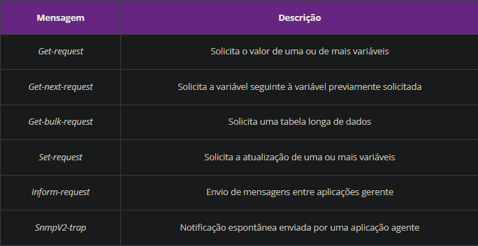

# Web Aula 8

## Camada de Transporte

### Multiplexação e Demultiplexação

Para distinguir qual processo será executado com os dados do pacote, a camada de trasporte executa a multiplexão e demutiplexação. Usando o número / endereço de porta de origem e destino.

O número da porta de origem é a porta do processo de origem, enquanto o destino é a porta da aplicação do destino.

### Protocolos de Transporte TCP

**TCP (Transmission Control Protocol)** implementa um serviço de transporte **orientado a conexão**, onde a comunicação é segmentada em cabeçalhos de 20 bytes mais uma quantidade definida pelas regras RFC.

Existe restrições de tamanho, cada segmento com cabeçalho deve caber na carga útil das camadas inferiores (1460 bytes ou 512 bytes); e o segmento precisa caber no menor **MTU (Maximun Transmission Unit)** da camada de enlace.

Visto que é orientado a conexão, apenas os dispositivos finais (transmissor e receptor) mantêm o estado da conexão, e não os roteadores intermediários.

O mecanismo usado pelo TCP é a **janela deslizante**. Para cada segmento enviado na janela, o transmissor dispara um **temporizador de retrasmissão**. Quando o segmento chega, o receptor retora um número de confirmação, sendo o número sequencial que espera receber. Se houver um timeout, o transmissor reenvia o segmento.

O maior trabalho para gerenciar o congestionamento é feito pelo TCP. O **controle de congestionamento** controla a taxa de transmissão limitando o número de segmentos que ainda não foram transmitidos, controlando o tamanho da janela de transmissão. Inicialmente pequeno e aumentando até perder segmentos, daí diminui e aumenta novamente.

Problema com conexões sem fio pelo TCP assumir que a perda de segmentos é devido a congestionamento, mas pode ser devido a interferência, diminuindo o tamanho, demorando ainda mais.

O **controle de fluxo** é feito pelo receptor, que informa o transmissor o tamanho da **janela de recepção**, que é o tamanho do buffer de recepção, mantido no transmissor.

Além do temporizador de retransmissão, existe o de **persistência** (peidido de pausa continua válido) e **keep-alive** (para manter a conexão sem uso ativa).

#### Cabeçalho do protocolo TCP:

- **Origem**: Porta de origem. IP e porta forma um **TSAP** (Transport Service Access Point) de 48 bits.

- **Destino**: Porta de destino. Formando outro **TSAP** (Transport Service Access Point) de 48 bits.

- **Sequência**: Qual parte da mensagem.

- **Confirmação**: Qual parte da mensagem foi recebida e qual o próximo segmento.

- **Comprimento**: Comprimento da parte opcional.

- **Controle**: Se é um número de confirmação válido; Se é para esperar o segmento inteiro; Se é para estabelecimento ou encerramento da conexão.

- **Janela**: Quantidade de bytes a ser transmitida, conforme última confirmação e capacidade do receptor.

- **Soma**: Soma de verificação.

- **Ponteiro**: Permite o transmissor enviar um sinal sem envolver um serviço do TCP.

#### Programação de aplicações de rede com TCP

Baseado em um par de programas: servidor e cliente, onde a comunicação é feita através de **sockets**. Finalizados quando um dos lados decide encerrar a conexão.

O cliente inicia a conexão (CONNECT) com o IP e TSAP, o servidor espera por uma conexão (LISTEN) e retorna ACCEPT e recebe um acknowlegment (ACK) concluindo o processo de conexão.

### Protocolos de Transporte UDP

**User Datagram Protocol (UDP)** é um protocolo sem conexão.

Não possui:
- Estabelecimento de conexão;
- Confirmação de recebimento;
- Controle de fluxo;
- Controle de congestionamento;

Possui um cabeçalho pequeno (8 bytes) e sua taxa de trasmissão depende da capacidade de geração de dados da aplicação de origem. Funcionalidade importante para *streaming*.

O UDP anexa os números de origem e destino, adiciona campo de soma e comprimento, passa para a camada de rede que encapsula em um datagrama IP, e faz uma tentativa de melhor esforço para entregar o segmento.

#### Cabeçalho do protocolo UDP:

- Origem: Endereço da porta e IP de origem. Formando um TSAP (Transport Service Access Point) de 48 bits.

- Destino: Endereço da porta e IP de destino. Formando outro TSAP (Transport Service Access Point) de 48 bits.

- Comprimento: Comprimento do cabeçalho junto aos dados.

- Soma: Soma de verificação.

#### Programação de aplicações de rede com UDP

Como TCP usam sockets, onde dois processos são ativos sem que exista mecanismos de QoS (Quality of Service).

app 1 | app 2
--- | ---
socket(UDP,porta1) | socket(UDP,porta2)
send(IP2:porta2, data) -> | receive(buffer)
receive(buffer) | <- send(IP1:porta1, data)

### Protocolos de Transporte Multimídia RTP

**Real-Time Transport Protocol (RTP)** é um protocolo de transporte de dados em tempo real, como áudio e vídeo, preferencialmente enviados através do UDP.

No RTP, cada segmento recebe um número sequencial, que permite o destino calcular os segmentos faltantes por interpolação, a retransmissão não é aconselhável pelo tempo perdido.

Muitas aplicações multimídia usam um indicador de tempo para que o destino armazene temporariamente os segmentos e os reproduza no tempo correto. Esse uso elimina a variação de tempo de atraso causado pela rede (**jitter**) e permite a sincronização de vários fluxos contínuos simultâneos.

O servidor envia os segmentos RTP encapsulados em sockets UDP ou TCP para o cliente, que os extrai e reconstitui o fluxo contínuo pelo cabeçalho.

#### Cabeçalho do protocolo RTP:

- Versão: Versão do protocolo e bits de controle.

- Tipo: Tipo de codificação de fluxo contínuo no campo de dados.

- Sequência: Contador de pacotes para que o cliente consiga identificar quais foram perdidos.

- Tempo: Número que permite sincronização de servidor e cliente sem jitter, através da indicação temporal que foi gerado o sinal do fluxo contínuo.

- Identificação: Identifica geradores de fluxo contínuo, on o cliente pode tratar mais de uma mídia na mesma sessão.

Para ter controle de congestionamento, pode ser usado o **RTCP (Real-time Control Protocol)**. São transmitidos por cada dispositivo da sessão RTP para os demais, por um endereço IP de multidifusão, normalmente existindo apenas um na sessão.

### Segurança de Camada de Transporte

Existem dois tipos de esquemas: **SSL (Secure Sockets Layer)** e **TLS (Transport Layer Security)**.

O SSL é uma interface desenvolvida para garantir sigilo e autenticação. Se baseia na implementação de um socket convencional.

Começa negociando o algoritmo e chaves simétricas, depois autentica cliente e servidor pela troca de um certificado presente no servidor, estabelecendo a segurança da conexão. É usado no comércio eletrônico e bancos, implementados em todos navegadores e servidores WWW.

O TLS é uma versão mais recente do SSL, com melhorias de segurança na geração das chaves simétricas.

Exemplo: HTTP (hypertext transfer protocol) passa a ser HTTPS (hypertext transfer protocol secure) com TLS. Ou SMTP (simple mail transfer protocol) passa a ser SMTPS (simple mail transfer protocol secure) com TLS.

---

# Web Aula 9

## Camada de Aplicação

O protocolo da camada de aplicação define:

- Tipos de mensagens trocadas;

- Sintaxe das mensagens;

- Semântica dos campos;

- Regras para determinar quando e como um processo envia e responde mensagens;

### Serviço de Diretório

O **DNS (Domain Name System)** é um serviço de diretório que mapeia nomes de domínio em endereços IP. É um banco de dados distribuído e hierárquico, que permite a consulta de nomes de domínio e endereços IP.

Para mapear um nome de um dispositivo em um endereço IP, um programa chama uma função de rede passando o nome do equipamento de destino. A função envia um pacote UDP para um servidor DNS, que responde com o endereço IP.

A internet é dividida em vário domínios de primeiro nível e particionada sucetivamente em subdomínios. O órgão responsável por gerenciar os domínios é o **ICANN (Internet Corporation for Assigned Names and Numbers)** pela **IANA (Internet Assigned Numbers Authority)**.

Os domínios de primeiro nível são divididos em: *Genéricos* (**GTLDs** - Generic Top Level Domain) e *Países* (**CCTLDs** - Country-Code Top Level Domain).

No Brasil, o órgão responsável pela organização do domínio de país .br é o **Comitê Gestor da Internet**.

Exemplo de domínio *departamento.filial.empresa.srv.br*. Organizado em ascendência até o primeiro nível.

Para contornar a restrição de um único servidor DNS com todos os nomes de domínio, o DNS foi desenvolvido decentralizado, contendo apenas as informações dos equipamentos registradas localmente, recursivamente e hierárquica.

Quando a função de rede requisita o nome de domínio buscado, o DNS envia para um dos servidores de nomes locais. Caso encontrado, será retornado o registro de recurso oficial. Um **registro oficial** é aquele fornecido pela autoridade que gerencia o registro de nomeação. Caso não encontrado, o servidor de nomes encaminhará a requisição para um servidor de nomes de primeiro nível, onde fará uma requisição ao DNS que possuí o domínio de primeiro nível, retornando o nome que encontrou no subdomínio.

Para segurança, o DNS usa o **DNSSEC (Domain Name System Security Extensions)**, que adiciona uma assinatura digital a cada registro de recurso. Num ataque DNS, é muito difícil de ser detectado e impossível de ser prevenido.

### Transferência de Arquivos

O protocolo de aplicação usado para transfência de arquivos é o FTP (File Transfer Protocol), usando duas conexões TCP, uma para controle e outra para dados.

- Controle: Usada para verificar os equipamentos, como usuário, senha, comando para troca de diretório, e comandos para lidar com arquivos.

- Dados: Usada para transferência de arquivos (nova conexão para cada arquivo).

No **modo ativo** o usuário inicia uma sessão FTP com o servidor, criando a conexão de controle na porta, exemplo 21. O cliente pede pela transferência do arquivo, o servidor abre uma conexão de dados na porta 20 alterada por uma porta indicada pelo cliente, envia ou recebe e encerra a sessão.

Já no **modo passivo**, o FTP cria uma conexão TCP em uma porta não bloqueada, com o mesmo processo do modo ativo.

Os comando são enviados em texto legível pela conexão de controle.

Para segurança, usar FTPS (File Transfer Protocol Secure), SFTP (Secure Shell File Transfer Protocol) ou até HTTPS (Hypertext Transfer Protocol Secure).

### Correio Eletrônico

Possui três componentes:

- Agentes de Usuários: Programas de correio eletrônico, por linha de comando ou interface, com as funcionalidades conhecidas.

- Servidores de Correio Eletrônico: Servidores que contêm as caixas postais dos usuários e encaminham as mensagens aos destinatários.

- Protocolos: **SMTP (Simple Mail Transfer Protocol)** para transferência de mensagens entre servidores e **POP3 (Post Office Protocol)**, **IMAP (Internet Mail Access Protocol)** ou **HTTP (Hypertext Transfer Protocol)** para transferência de mensagens entre servidor e cliente.

#### Encaminhamento de Mensagens (SMTP)

**SMTP** encaminha a mensagem do servidor do remetente até o servidor do destinatário. Só é capaz de transmitir mensagens com caracteres ASCII de 7 bits. Atualmente as mensagens são codificadas e decodificadas para transferência.

Usando a porta 25, os servidores fazem uma conexão TCP com identificações e trocam todas as mensagens da fila para os destinatários do mesmo servidor de correio eletrônico de destino.

As mensagens possuem cabeçalho, linha em branco e corpo. O cabeçalho contém o endereço do remetente, destinatário, assunto, data e hora, e outros campos opcionais.

Para transferência de multimídia, foi criado o MIME (Multipurpose Internet Mail Extensions), exentendo o corpo para definir regras de mensagens não-ASCII. Para segurança, usar S/MIME (Secure MIME) garantindo autenticação, integridade, sigilo e não repudiação.

#### Consulta à Caixa Postal (POP3, IMAP, HTTP)

**POP3** usado para buscar as mensagens de um cliente no servidor e movê-las para o agente cliente, gerenciando apenas localmente, sem poder criar pastas. Não é necessário manter uma conexão com o servidore, porém não é possível acessar as mensagens de outros dispositivos.

Para o processo de visualização com POP3, é estabelecida uma conexão TCP na porta 110 e passa por três fases:

- Autorização: Usuário e senha para autenticação (user, pass).

- Transação: O usuário pode listar as mensagens (list), recuperar uma mensagem (retr), apagar uma mensagem (dele), reiniciar a sessão (rset) e encerrar a sessão (quit).

- Atualização: O servidor apaga as mensagens marcadas para deleção e conclui a sessão (quit).

**IMAP** muito mais avançado que o POP3, usando conexões na porta 143. Permite criação de pastas direto no servidor, sem precisar movê-las para a estação local, garantindo acesso por qualquer estação que tenha acesso ao servidor.

Tem funcionalidade de recuperar apenas uma parte da mensagem. Somente o que está sendo visualizado é transferido localmente.

**HTTP** é usado para acessar a caixa postal através de um navegador, onde a mensagem é encaminhada do servidor de correio eletrônico via IMAP até um servidor web para sua visualização.

### Gerenciamento de Redes

Disponibilidade de novas tecnologias, usadas tanto pelos provedores de serviços quanto pelas empresas de implementação de sistemas integrados de gerência.

O ITU-T (International Telecommunication Unio - Telecommunication Standardization Sector) dividiu o gerenciamento em áreas funcionais:

- Falhas: Detectar, isolar e corrigir falhas de rede.

- Configuração: Manter informações de configuração para todos os componentes da rede.

- Contabilização: Manter informações de uso de recursos para cobrança.

- Desempenho: Monitorar e avaliar o desempenho da rede.

- Segurança: Controlar o acesso à rede.

Não há homogenia entre as redes devido:

- Desinteresse de fabricantes de transmissores de dados por competitividade;

- Complexidade dos modelos de informação **MIB (Management Information Base)** baseados em **ASN.1 (Abstract Syntax Notation One)**;

- Impossibilidade de manter modelos de informação de equipamentos e serviços dinamicamente e incremental.

A incompatibilidade se dá por conta dos diferentes modelos de informação por parte das aplicações de gerenciamento. As atualizações e manutenções dessas aplicações são muito caras e difíceis de serem feitas com a atual tecnologia incorporada para o modelo de referência TCP/IP, o **SNMP (Simple Network Management Protocol)**, pois requer que todos os recursos sejam conhecidos pelos grupos de desenvolvimento dos sistemas de gerência de redes.

#### SNMP

A infraestrutura de gerenciamento especificada pela **ISO (International Organization for Standardization)** para o modelo de referência OSI, baseia-se em **informações de gerência** como atributos de **objetos gerenciados**.

As informações de gerência são referenciadas como sendo a base de informações de gerência - **MIB (Management Information Base)**. As entidades de gerenciamento podem assumir os papéis de **gerente** e **agente**, se comunicando com **protocolo de gerência**.

O papel de gerente faz requisições de operações e recebe notificações, enquanto o agente, incorporado no sistema gerenciado, envia respostas e emite notificações espontaneamente.

É usada POO para descrever as informações armazenadas em uma MIB SNMP. O SNMP usa o **SMI (Structure of Management Information)**, usando a notação **ASN.1 (Abstract Syntax Notation One)**.

O SNMP usa o **UDP (User Datagram Protocol)** solicitando informações ou forçando atualização de estado do agente, enviando uma notificação de acordo com o formato especificado na MIB.

Segue tabela de mensagens entre agente e gerente:

#### MIB

Os **objetos gerenciáveis** são instâncias de uma classe de objetos, definidos em uma MIB. A MIB é uma coleção de objetos gerenciáveis.

Características de uma classe de objetos gerenciáveis:

- Atributos

- Operações de gerência

- Comportamento

- Mensagens de notificação

A **MIB (Management Information Base), ou modelo de informação de gerência**, procura abranger todas as informações para a gerência da rede. Cada objeto da coleção é identificado por um número sequencial, correspondente aos nós percorridos até o objeto.

# Web Aula 10

## Navegação na internet e Redes multimídia

### World Wide Web

Tim Berners-Lee do CERN (European Organization for Nuclear Research) criou a **World Wide Web** em 1989, com o objetivo de compartilhar informações entre pesquisadores de física de partículas.

**Navegador internet** interpreta as **páginas** distribuídas nos **sites** acessados por **links**

Em 1994 fundou-se a World Wide Web Consortium (W3C – www.w3c.org), para padronização e incentivar a interoperabilidade dos servidores.

O protocolo de aplicação utilizado para a transferência de páginas internet entre sistemas computacionais é o **HTTP (Hypertext Transfer Protocol)**.

Comunicação entre navegador internet e servidor internet em requisições e respostas de páginas através do HTTP.

As páginas são localizadas por uma URL (Uniform Resource Locator).

Uma URL completa tem:

- Protocolo para obter o arquivo (http://)

- Endereço do servidor - nome do domínio traduzido por um DNS (www.ab.com.br/)

- Diretório dentro do servidor onde está o arquivo (diretoriofoda/)

- Arquivo (pagina.html)

#### Páginas Internet Estáticas

As páginas são arquivos estáticos (objetos) com referências a mais objetos.

A W3C desenvolveu mais as linguagens **XML (Extensible Markup Language)** para dados e **XSL (Extensible Style Language)** para formatação.

Para comunicação por XML independente da linguagem e sistema é usado o **SOAP (Simple Object Access Protocol)**, requisitando e recebendo um arquivo XML, garantindo homogenia.

#### Páginas Internet Dinâmicas

Javascript

**CGI (Common Gateway Interface)**: mecainsmo de comunicação entre o servidor e programas externos, que podem ser escritos em qualquer linguagem de programação.

Servlet Java: programa executado no servidor, escrito em Java, que recebe requisições e envia respostas, deixando de funcionar após término da conexão do cliente.

Outra forma é o **PHP (Hypertext Preprocessor)**, mais simples que CGI. **JSP** - Java - e **ASP** - Visual Basic - também são usados como PHP.

#### Comunicação entre Programa Cliente e Servidor

Há dois tipos de conexões HTTP:

- **Persistentes**: Criada uma conexão para cada grupo de objetos da página.

- **Não persistentes**: Cada objeto da página é transferido em uma conexão diferente.

Uma **mensagem HTTP de requisição** é composta por uma linha inicial (denominada linha de requisição), várias linhas adicionais contendo opções específicas para a requisição (denominadas linhas de cabeçalho) e uma linha final em branco.

Tipos de Mensagens de Requisição:

- **GET** Solicita um arquivo

- **HEAD** Solicita apenas o cabeçalho da mensagem de resposta sem o arquivo

- **PUT** Envia um arquivo

- **POST** Anexa dados a um arquivo no servidor

- **DELETE** Exclui um arquivo no servidor

- **TRACE** Envia de volta a requisição com propósito de depuração

- **OPTIONS** Permite consultar o servidor sobre suas propriedades ou sobre as de um arquivo

Uma **mensagem HTTP de resposta** é composta por uma linha inicial (denominada linha de status), várias linhas adicionais contendo opções específicas para a resposta (denominadas linhas de cabeçalho), uma linha em branco e o conteúdo do objeto propriamente dito.

Para aumentar o desempenho, o **proxy** armazena as páginas mais acessadas em um cache, evitando o acesso ao servidor.

#### Cookie

O cookie é um mecanismo que alguns servidores internet utilizam para acompanhar os acessos sucessivos de um determinado usuário, implementando assim um conceito de sessão de usuário.

### Redes Multimídia

A solução para a transmissão de multimídia pela internet reside em classificar todo o seu tráfego, definir prioridades para diferentes aplicações e reservar banda de transmissão

O IETF desenvolveu um modelo chamado **Integrated Services (IntServ)** que inclui a transmissão em tempo real à arquitetura internet. Tendo a capacidade de reservar recursos através da rede por um controle de admissão.

Essa reserva pode usar o **RSVP (Resource Reservation Protocol)**, implementado em cada roteador.

Outro modelo QoS é o **Differentiated Services (DiffServ)**, sem a necessidade de usar uma reserva. Usa o campo **ToS (Type of Service)** do cabeçalho IP, escolhendo serviços para minimizar custo e/ou maximizar fluxo. Como não é implementado como RSVP, cada router na rede só conhece o valor da marcação do pacote a ele encaminhado.

#### Aplicações Multimídia

- Fluxo contínuo de áudio e vídeo armazenado

> O tempo decorrido entre a solicitação de uma dessas ações pelo cliente e a execução da ação deve ser da ordem de até 5 segundos para que a resposta seja considerada aceitável

- Fluxo contínuo de áudio e vídeo em tempo real

> O tempo decorrido entre a solicitação do fluxo contínuo até o início da sua reprodução deve ser da ordem de até 10 segundos para que a resposta seja considerada tolerável.

Áudio interativo em tempo real é denominado **Telefonia IP**

Já vídeo são **Videoconferência e Videofonia IP**.

O tempo aceitável dessa aplicação é de 0.5s.

Antes que o áudio ou o vídeo possa ser transmitido pela internet, eles precisam ser **digitalizados** e **comprimidos**.

Digitalização de áudio é feita com **PCM (Pulse Code Modulation)**.

Para compressão pode-se utilizar GSM, G.729, G.723.3, mas a principal é o **MPEG-1 (Moving Picture Experts Group)** baseado no MP3, também usado para vídeo.

#### Fluxo Contínuo de Áudio e de Vídeo

Usado o **Real Time Protocol (RTP)** para o transporte de áudio e vídeo.

**Tocador de mídias (media player)** gerencia o fluxo com os processos:

- Descompressão

- Remoção do Jitter: Jitter é a variação de tempo de atraso entre origem e destino, usando bufferização local.

- Correção de erros: Redundância de pacotes ou interpolação.

- Interface Gráfica

**RTSP (Real-time Streaming Protocol)** criado para permitir as ações pausar, reproduzir, gravar, reposicionar, avançar e retroceder.

#### Fluxo Contínuo de Áudio e de Vídeo Interativo

O **SIP (Session Initiation Protocol)** é um protocolo de sinalização para estabelecer, modificar e terminar sessões multimídia interativas.

- Mecanismo para estabelecer e encerrar chamadas por uma rede TCP/IP.

- Mecanismo para localizar um destinatário na rede.

- Mecanismo para gerenciamento de chamadas.

Equipamentos SIP também incluem **Media Gateways**, **Gatekeepers**, **Telefones IP** e **ATAs (Analog Telephone Adapter)**.

Os media gateways permitem a comunicação entre terminais SIP.

Os gatekeepers são servidores SIP que gerenciam as chamadas.

Os ATAs são adaptadores dedicados que permitem que telefones tradicionais se conectem diretamente em uma rede TCP/IP tornando-os telefones IP.

Durante o processo de estabelecimento de uma chamada, a mensagem SIP de convite contém os parâmetros **SDP (Session Description Protocol)** para identificação e controle da conexão.

**MGCP (Media Gateway Control Protocol)** é usado entre terminais SIP e aparelhos telefônicos

