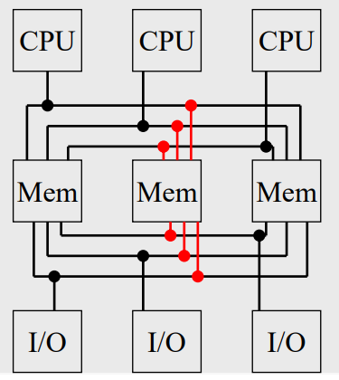

# Introdução

Sistema operacional é um conjunto de rotinas executado pelo processador.

Gerencia os recursos disponíveis do sistema

Também chamado de **monitor** / **executivo** / **supervisor** / **controlador**.

### Funções

- Permitir que programas armazenem e obtenham informações

- Isolar informações específicas de hardware

- Controlar o fluxo de dados entre componentes

- Programas executam sem interferência de outros programas

- Permite que programas independentes cooperem periodicamente e compartilhem informações

- Responder a erros ou solicitações do usuário

- Impor escalonamento / prioridade entre programas que solicitam recursos

- Facilitar acesso aos recursos

---

O SO cria um ambiente simulado que serve de interface entre usuário e o sistema, chamado de **VM**, presente na maioria dos sistemas atuais.

### Máquina de Níveis

Dois níveis: Inicialmente o inferior (hardware) e superior (software).

Usuário só enxerga a máquina como sistema operacional, essa visão é denominada de **VM**.

Mas não são apenas dois níveis:

|   |   |
|---|---|
| Aplicativos          |
| Utilitários          |
| Sistema Operacional  |----------|
| Linguagem de Máquina |Hardware|
| Microprogramação     |
| Dispositivos Físicos |

### Tipos de SO - História

#### Fase 0 (1940)

- **Programação com fios**

- Sem sistema

- Acesso completo a linguagem de máquina

#### Fase 1 (1950)

- Processamento em batch

- **Válvulas e Paineis**

- Início da segunda Guerra surgiram os primeiros computadores digitais

- ENIAC, EDVAC, IAS, UNIVAC

- Profundo conhecimento em hardware (programação em paineis)

#### Fase 2 (1956/65)

- Multiprogramação

- **Transístores**

- Memórias magnéticas

- Primeiras linguagens (Assembly e Fortran)

- Surgimentos dos primeiros SOs

- SO passam a ter próprio conjunto de rotinas de I/O, surgindo o conceito de **independência de dispositivos**

- Conceito de **Canal** (transferência entre dispositivos e memórias).

#### Fase 3 (1966/80)

- Sistemas de propósito geral

- Circuitos Integrados e Multiprogramação

- Difusão de sistemas computacionais por empresas

- **Multiprogramação**: um processo pode ser executado enquanto outro aguarda um requisição I/O

- Fita -> Discos, permitindo o **spooling**, tarefa em sequência aleatória

- Teclado e monitor

- Time-Sharing

- UNIX baseado no MULTICS

#### Fase 4 (1981/90)

- Estado da arte

- **CI e Multiprocessamento** -> user friends

- **LSI (large scale of integration) e VLSI (very large scale of integration)** levaram o projeto de miniaturização e barateamento dos equipamentos

- PC 16 bits

- MSDOS

- Conceito de multitarefas e multiprocessamento, mesmo em monousuários

- SO de redes

#### Fase 5 (1991/Hoje)

- Arquitetura paralela

- Processamento distribuído

- Cliente / Servidor, acesso remoto

- Interface gráfica, interações mais orgânicas

 

# Hardware

CPU | Memória principal | Dispositivos I/O

### CPU

Unifica todo o sistema, controlando as funções das unidades. Responsável pela execução de todos os programas do sistema

### Clock

Dispositivo na CPU que gera pulsos constantes (síncronos) em um mesmo intervalo de tempo (sinal de clock). O intervalo determina o seu período (**Estado**)

Sinal de clock usado pela CPU para a execução das instruções. A execução de uma instrução demora vários Estados.

### Registradores (CPU)

Dispositivos específicos e de propósito geral de alta velocidade fisicamente na CPU.

### Memória Principal (RAM)

Chamada de primária ou real, armazena instruções e dados.

Acesso ao conteúdo de posição é feito por um número chamado endereço (**RAS** - row address strobe, **CAS** - collumn address strobe) sendo uma referência única.

Composta por células de 8 bits (passado 16, 32 até 64)

Acesso através do registrador **MAR (memory address register)** | Dados guardados pelo registrador **MBR (memory buffer register)**

##### Ciclo de leitura

CPU armazena no MAR o endereço a ser lido; CPU gera um sinal para a memória avisando a operaçãod e leitura; Conteúdo da posição de memória é transferido para o MBR.

##### Ciclo de escrita

CPU armazena no MAR o endereço a ser escrito; CPU armazena no MBR o dado a ser escrito; CPU gera um sinal para a memória avisando a operação de escrita; Conteúdo do MBR é transferido para a posição de memória do MAR.

Capacidade depende do tamanho do MAR 2^n - 1

### Memória Cache (CPU)

Mais performático que a memória principal.

### Memória Secundária (Discos, Fitas, etc.)

Meio permanente de armazenagem de programas e dados. Não volátil

### Dispositivos I/O

Permite comunicação entre o sistema e o mundo externo.

Divididos em: Usados como memória secundária e que servem de interface homem-máquina.

### Barramento (Bus)

Conjunto de trilhas paralelas que tranferem informações como dados, endereços e sinais de controle.

- Dados

- Controle

- Endereços

### Pipelining

- Linha de montagem

- Divide a intrução em tarefas

- Thread física

### Ativação / Desativação

- Boot

- MBR (Master boot record)

- Shutdown

### RISC (Reduced Instruction Set Computer)

- Instruções simples executadas no núcleo, sem acesso à memória

- Facilidade de implementação de pipeline

### CISC (Complex Instruction Set Computer)

- Usam microprogramas para serem executadas

- Qualquer instrução pode referenciar qualquer posição de memória

- Poucos registradores

 

# Software

Utilitários são serviços do sistema operacional como compiladores, linkers, depuradores, etc.

Programas desenvolvidos pelos usuários são chamados de **aplicativos**.

### Tradutor

Passa os símbolos do fonte para código de máquina na etapa de conversão.

Módulo gerado é chamado de **módulo-objeto**, mesmo em código de máquina, ainda não pode ser executado.

Tradutor não tem capacidade de fazer associações entre módulos-objeto, para isso é necessário o **linker**.

### Montador (Assembler)

Linguagem de montagem é um conjunto de mnemônicos que representam instruções do processador (dependendo do hardware), gerando um programa em linguagem de máquina não executável (objeto).

### Compilador (linguagem de alto nível)

Gera um programa em linguagem de máquina não executável (objeto) a partir de uma de alto nível.

Independente do hardware.

Usa serviços do sistema operacional sem precisar de linguagem de controle ou utilitários.

### Interpretador

Tradutor que não gera código-objeto. Em runtime, traduz e executa instruções.

Permite implementação de tipos dinâmicos.

### Linker (Linkage Editor)

Gera um programa executável a partir de módulos-objeto, resolvendo suas referências.

Determina a região da memória onde o programa será alocado (**relocação**)

- Código Absoluto: Endereços pré-fixo (antigo)

- Código Relocável: Endereços traduzidos dinamicamente (atual)

**Linking Loader**: Resolve as referências no momento da execução, gera um alto **overhead**.

### Loader

Utilitário para colocar fisicamente na memória o programa para execução.

O procedimento varia dependendo do código gerado pelo linker, podendo ser absoluto ou realocável.

- Absoluto: Precisa de um endereço inicial e tamanho do módulo

- Realocável: Usa a MMU (Memory Management Unit) para carregar em qualquer local - Endereço lógico + Registrador Relocador = Endereço físico

### Depurador (Debugger)

Permite o usuário controlar toda a execução a fim de detectar erros

### Linguagem de Controle / Comando

Forma direta do usuário interagir com o SO.

Usa o interpretador de comandos ou shell.

### Linguagem de Máquina

Processador realmente entende. Totalmente em binário.

Executa direto na CPU mas é exclusivo para o processador

### Microprogramação

RISC programa é executado diretamente pelo hardware, CISC não.

Microprogramas definem a linguagem de máquinade cada computador.

 

# Tipos de SO

- Monoprogramáveis / Monotarefas

- Multiprogramáveis / Multitarefas

- Múltiplos Processadores

## Monoprogramáveis

Permite o processador, a memória e periféricos serem usados por um único programa.

Fácil de implementar, por não precisar de proteção.

O sistema é subutilizado por nem todas as partes estarem sendo usadas por completo.

## Multiprogramáveis

Vários programas dividem os recursos.

SO é responsável por controlar o acesso concorrente aos recursos.

São mais complexos, mas conseguem aumentar a produtividade e reduzir os custos

Podem ser **Monousuário** ou **Multiusuário**

São classificados em: **Batch**, **Time-Sharing** e **Real-Time**

### Batch (lote)

Seus programas ficam armazenados em disco ou fita e esperam para serem executados em sequência.

Os programas são independentes da interação do usuário, lendo e gravando dados.

Exemplos: Compilações, linkedições, sorts, etc.

### Time-Sharing (tempo compartilhado)

Vários usuários interagem com o sistema ao mesmo tempo, cada um com seu próprio terminal (interação online). Usuário pode interagir com a instância das suas aplicações.

Para cada usuário, o sistema aloca uma fatia de tempo do processador, além de dividir a memória e periféricos.

### Real-Time (tempo real)

Semelhantes ao tempo compartilhado, o tempo de resposta é fundamental.

Um programa executa o tempo que for necessário, ou até aparecer um outro programa com maior prioridade.

## Múltiplos Processadores

Duas ou mais CPUs interligadas

### Fortemente Acopladas (tightly coupled)

Compartilham memória e periféricos.
Assimétricos (Master / Slave); Simétricos (Simmetric Multiprocessing - SMP); Multiprocessamento

#### Assimétricos

Somente um processador executa serviços do SO. Mestre responsável por toda I/O.

#### Simétricos

Todos processadores realizam a mesma função. Boot em um processador.

#### Multiprocessamento

Divisão de tarefas entre CPUs. Podendo ser Processamento Vetorial e Paralelo.

##### Processamento Vetorial

Dados escalares

Alto custo e organização complexa

Combinam vetores de entradas e de saída

##### Processamento Paralelo

Aplicação pode rodar em mais de um processador simultaneamente

Útil para aplicação que podem ser divididas em partes independentes

Usuário pode determinar o paralelismo.

### Fracamente acopladas (loosely coupled)
Cada CPU tem sua própria memória e periféricos

SO de Redes ou Distribuídos

#### SO de Rede

Cada nó possui seu SO, mas podem compartilhar recursos.

Com falha, pode haver falta de recursos.

#### SO Distribuídos

Balanceamento de carga.

Relacionamento forte entre os componentes.

Redundância (dispositivo assume em caso de falha de outro).

## Tipos de Barramentos

- Comum

- Cruzado

- Multiport

 

# Concorrência - Multiprogramáveis

Tarefas trabalharem simultaneamente são o princípio básico dos sistemas multiprogramáveis. Buscando melhor utilização dos recursos.

Durante o processamento de um programa, podem acontecer interrupções (assíncrono) ou exceções (síncrono)

Esses eventos podem ser resultado da execução do programa; gerado pelo SO; ou dispositivos de hardware.

A interrupção pode ser interna ou externa:

- Interna (Traps ou Exceções): Resultado da execução do programa, podem ser tratada pelo programa. Exemplo: Divisão por zero, overflow da representação numérica, etc.

- Externa / Do Sistema: Gerado pelo SO ou algum dispositivo. Exemplo: Periférico avisa CPU avisa que está pronto para transferir dados.

Interrupções podem ser **Mascaráveis** podendo ser desabilitadas pelo processadou ou **Não Mascaráveis** que precisam de tratamento obrigatório.

### Vetor de Interrupção

Contém o endereço da rotina de tratamento de interrupção.

A partir do endereço, o SO faz o desvio para a rotina de tratamento.

Passos de execução de interrupção:

- Salva registradores

- Identifica a origem

- Obtém o endereço de tratamento

- Restaura registradores

## Operações de I/O

Antigamente, CPU realizava I/O.

São instruções específicas do hardware, limitando a comunicação entre CPU e periféricos.

Implementa o controlador de interface, deixando a CPU livre para outras tarefas.

CPU esperava o processador de I/O -> CPU ficava perguntando se havia terminado (**pooling**) -> Hardware passa a interromper, gerando muito processo para transferir algo para a memória -> DMA (Direct Memory Access): CPU participa do fim e início da transferência.

## Buffering

Área de transferência de dados entre periféricos e memória. Diminuindo a disparidade entre velocidade de processamento e de I/O.

## Spooling (Simultaneous peripheral operation on-line)

Gera arquivos de impressora para o disco e posteriormente imprimir.

## Reentrância

Upload de um programa para a memória, permitindo que vários usuários usem o mesmo programa ao mesmo tempo. Cada usuário tem sua área de dados.

## Proteção do Sistema

Memória compartilhada com diversos programas.

Acesso a arquivos por vários usuários. (Lock)

Loops infinitos em programas. (Timer controla a interrupção do processador)

 

# Estrutura do SO

Chamadas aos eventos são relacionadas ao hardware ou SO.

Conjunto de rotinas é chamado de **Kernel**.

### Funções do Kernel

- Tratamento de interrupções

- Cria ou elimina processos

- Sincronização e comunicação entre processos

- Escalonamento e controle de processos

- Gerência de memória

- Gerência de arquivos

- Operações de I/O

- Contabilização e segurança do sistema

### System Calls

Sempre que o usuário solicita um serviço do sistema, é realizada um System Call, sendo porta de entrada entre o núcleo e a aplicação.

Cada serviço possui sua SC.

Possuem nomes, parâmetros e forma de ativação (Os parâmetros também devolvem o retorno).

São divididas em: **Gerência de processo**, **Gerência de memória**, **Gerência de I/O**

### Modos de Acesso

Operações I/O só podem ser feitas pelo SO

Instruções que violam o sistema: Privilegiadas; Sem perigo: Não privilegiadas.

Para privilegiadas, precisa implementar o modo de acesso:

- Modo Usuário: Sem privilégios.

- Modo Kernel: Acesso total ao conjunto de instruções.

Registrados especial determina se pode ser executada pela aplicação.

Núcleo sempre roda em modo Kernel.

Passos de execução:

- Requisita Operação (Systema Call)

- Chamada muda para modo Kernel

- Processa

- Retorna para modo Usuário

#### Desenvolvimento de SO

- Monolítica;

- Em camadas

- Cliente-Servidor

##### Monolíticos

Conjunto de rotinas que interagem livremente umas com as outras (vários procedimentos)

##### Em Camadas

Código construído em várias camadas;

Níveis se comunicam, isolando facilitando alteração e depuração.

Há proteção das camadas mais internas

##### Cliente-Servidor

Torna o núcleo menor e mais simples;

Divide o SO em processos, responsáveis por serviços: Cliente que solicita um serviço; Servidor que responde a solicitação.

Resposta também é uma mensagem, que o núcleo é responsável pela comunicação

O servidor executa em modo usuário

Caso ocorra erro no servidor, ele para sem comprometer o sistema

Pode ser distribuído

Fortemente acoplado

Fracamente acoplado

Difícil de implementar por fazer acesso direto ao hardware

Geralmente usa-se Cliente-Servidor/Camadas

