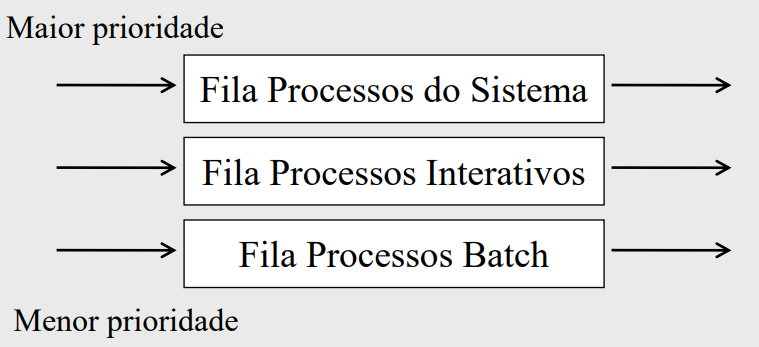
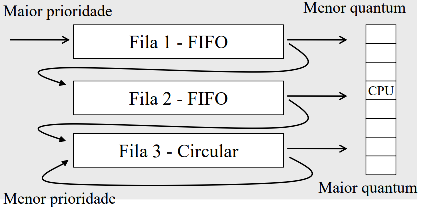

# Processos

Programa em execução

Processo altera o seu estado a medida da execução

Responsável pelas informações da execução do programa (registradores e memória)

Cada **usuário** executa um processo

### Modelo

O SO usa o **PCB (Process Controll Block)** - descritor de processo - para materializar o processo

O PCB armazena todas as informações do processo.

Processo é dividido em 3 elementos básicos:
- Contexto de Hardware;
- Contexto de Software;
- Espaço de Endereçamento;

#### Hardware

Conteúdo dos registradores. Fundamental para a troca de processos (**context switching**)

#### Software

Características do processo que vão influenciar na execução (n máx de arquivos, tamanho do buffer);

Algumas características mudam em runtime, outras são const

- **Identificação**: **PID (Process Identification)**, n único que identifica o processo no sistema
- **Quotas**: Determina o limite de cada recurso do sistema
- **Privilégios**: Define o que o processo pode fazer

#### Espaço de Endereçamento

Área de memória reservada para o programa, protegida dos demais processos

### Estados do Processo

- **Running**: Usando a CPU;
- **Ready**: Pronto para rodar, CPU ocupada
- **Wait**: Depende de um evento externo do processo (IO ou agendamento)

Espera pode ser dividido:
- Espera: Aguarda pela conclusão de uma operação;
- Bloqueado: Espera autorização para usar um recurso

Processos em espera ou prontos podem estar na *memória secundária*

Processos ficam em uma lista encadeada para controle

##### Mudança de estado

- Voluntária: operações I/O
- Involuntária: SO para programa em looping

|Mudança|Nome|Motivo|
|-|-|-|
Pronto -> Execução | Dispatch | Novamente
Execução -> Espera | | S/ condição
Execução -> Pronto | TimeRunOut | Tempo
Espera -> Pronto | WakeUp | Externo

#### Subprocessos

Permite a divisão de atividade para trabalhar concorrente

Cada subprocesso tem seu contexto de hardware, software e endereçamento

### Threads

Compartilham o processador da mesma forma que o processo

Tem seu contexto. Mas compartilham o endereçamento, onde uma pode alterar dados de outro thread. Trabalhando de forma cooperativa.

---

## Tipos de Processos

- CPU-bound
- I/O-bound

#### CPU-bound

Passa a maior parte em execução
Poucas operações I/O
Muitos cálculos necessários

#### I/O-bound

Maior parte em tempo de espera
Grande número de I/O
Aplicações comerciais e processos interativos

##### Operações sobre Processos
Criar um processo;
Destruir um processo;
Suspender um processo;
Retornar (reativar) um processo;
Alterar a prioridade de um processo;
Bloquear um processo;
Desbloquear um processo (wakeup);
Despachar um processo (dispatch).

#### Comunicação entre Processos

Troca de informações através de um buffer, há uma sincronização

**Problemas de compartilhamento de recursos**:
Acesso simultâneo de arquivos, Alteração de variáveis na memórias

**Exclusão Mútua**: impede acessar um mesmo recurso usado, usando critical section para alteração das variáveis e fazer o sincronismo no final.

Problemas:

- Processos não podem bloquear outro se estiver fora da CS dele.

- Nenhum processo pode esperar para entrar na sua CS (starvation).

- Evitar que mais de um processo execute sua CS.

- Sincronização condicional: Aguarda o buffer de sincronismo.

**Solução de Hardware**:
- **Inibição das Interrupções**: entra na CS, desabilita as interrupções, habilita quando sai. Podendo não habilitar de volta, comprometimento do sistema.

- **Instrução Test-and-set**: Lê a variável, armazena em outra área e atribui novo valor. Usando uma variável lógica, se falsa, faz a tranferência.

**Solução de Software**:
- **Semáforos**: Variável inteira não negativa, pode ser acessada por Down e Up. Quando aplicado na Exclusão Mútua é chamado de *Mutex*. Também existe a variante **Vazio e Cheio**, que controla o número de processos que podem acessar um recurso.

- **Monitores**: Módulo de programa que encapsula variáveis e procedimentos, onde o processo apenas reconhece o hambiente "monitor". Implementado pelos compiladores. Sincronização é definida por Wait e Signal sobre a estrutura de dados.

- **Troca de Mensagem**: Send e Receive, onde o processo envia e recebe mensagens. O SO é responsável pela comunicação entre os processos. Síncrono, transmissor espera receptor. Assíncrono, nenhum lado espera confirmação.

#### Dead Lock

Espera de um evento que nunca vai ocorrer

Condições:

- Cada recurso só pode estar alocado a um único processo;

- Um processo espera outros recursos além dos alocados;

- Um recurso não pode ser desalocado;

- Um processo espera pelo outro.

**Prevenção**:

- Remover Exclusão Mútua;

- Requisitar recursos antes de executar;

- Retirar o recurso de um processo, podendo perder o processamento realizado;

- Evitar referência circular (usar um recurso por vêz);

- **Algoritmo do Banqueiro**: determina execução segura. Soma os recursos que os processos vão usar + os que estão em uso.

Correção de Dead Lock pode causar overhead, pois a liberação de recursos pode acabar com o processamento realizado. Ou remover processos críticos.

---

## Escalonamento de Processos (Scheduling)

Parte do SO que define qual processo usar a CPU

**Objetivos**:

- Maximizar o uso da CPU;

- Balancear o uso da CPU;

- Maximizar o throughput, oferecendo respostas razoáveis para usuários;

- Trata todos os processos igualmente (--starvation);

- Menor overhead (troca de contexto);

- Equilíbrio entre resposta e utilização;

- Garantia de prioridade;

- Tempo de turnaround (tempo da admissão até o término do processo);

Decide baseado em política de escolha usando algoritmos de escalonamento

Problemas com cada processo. Muita I/O ou uso da CPU

### Tipos de Escalonamento

- **Não Preemptivo**: Processo em execução não pode ser interrompido. (batch)

- **Preemptivo**: Processo em execução pode ser interrompido. (interativo)

#### Não Preemptivo

**First In First Out - FIFO**

- Primeiro a chegar, primeiro a ser atendido;

- Algoritmo simples, só uma fila;

- Não prevê quando será executado, depende da fila.

**Shortest-Job-First – SJF**

- Menor tempo de uso são executados primeiro;

- Dificuldade de prever o tempo de execução;

**Cooperativo**

- Processo entrega a CPU quando termina;

- Processos podem monopolizar a CPU;

- Processo executa até "ouvir" requisição de outro processo;

#### Preemptivo

**Round-Robin (Circular)**

- Processos são executados por um tempo fixo (**quantum** ou **time-slice**);

- Nenhum processo pode monopolizar a CPU;

- Quantum muito pequeno causa overhead pelo context switch e muito grande pode não ser aceitável;

**Prioridade**

- Processos com maior prioridade são escalonados primeiro

- Sistemas de tempo compartilhado implementa um tipo de prioridade

- I/O-bound tem prioridade maior que CPU-bound

- Tipo de Prioridade:
  - Estática: modifica a prioridade com a existência do processo
  - Dinâmica: alterada pela necessidade do sistema

**Multi-level Queues - Múltiplas Filas com Realimentação**

- Classificados pelo tipo de processamento

- Cada fila tem uma prioridade

**Multi-level Feedback !ueues - Múltiplas Filas**

- Com prioridade dinâmica

- Mecanismo adaptativo com objetivo de ajustar os processos de acordo com o comportamento do sistema

**Sistema de Tempo Real**

- Tempo é crítico

- Prioridade estática

- Quanto mais importante, maior a prioridade

**Múltiplos Processadores**

- Sistemas fracamente aclopados fazem seu escalonamento local

- Fortemente acoplado tem uma *fila de pronto* para os processadores, determinando pelo priemeiro disponível. Implementando Exclusão Mútua

# Gerenciamento de Memória

O Gerente de Memória do sistema deve garantir segurança e eficiência.

**Memória principal** onde ficam os programas a serem usados pelo processador;

**Memória secundária** é o meio permanente;

## Memória Principal

#### Alocação Contígua Simples

Divide a memória principal em 2 (SO e programas do usuário)

Usuário tem total acesso à memória, inclusive do SO, podendo destruí-lo. Protegido através de um registrador

**Access Violation** acontece quando um programa usa memória que não foi alocada a ele

Problemas de limitação de acesso pode ser solucionado por overlay

- Técnica de **Overlay**: Divide o programa em módulso, usando uma mesma área de memória. A área de overlay é definida pelo maior disponível. Se preocupando apenas com transferência disco / memória.

#### Alocação Particionada

Permite que vários programas estejam na memória ao mesmo tempo

- **Estática**: Memória dividida em tamanhos estáticos. Mudadas apenas na reinicialização.
  - Absoluta: Programas referem a única memória, sem usar outra área
  - Relocável: Qualquer área que suporte o tamanho do programa executa

  Programas geralmente não ocupam toda a partição. Mesmo assim, programas grandes não são executados com partições adjacentes.

- **Dinâmica**: Dividida em tamanhos variáveis. Cada programa usa o espaço necessário. Fragmentação na saída, não permitindo outros programas executarem.

Soluções: Juntar partes adjacentes; Relocar programas (overhead).

Estratégias de alocação:

- **First Fit**: Aloca o primeiro espaço que cabe o programa (mais eficiente)

- **Best Fit**: Aloca o menor espaço que cabe o programa (aumenta a fragmentação)

- **Worst Fit**: Aloca o maior espaço que cabe o programa (dimini a fragmentação)

#### Swapping

Resolve o problema de falta de espaço na memória usando a memória secundária. Piorando a performance pela relocação dinâmica

### Memory Management Unit - MMU

Componente do hardware que faz a tradução de endereços lógicos para físicos

Mecanismo de proteção de memória:
- **Registradores de limite**: Testa o intervalo. Se estiver fora, gera um erro
- **Registradores de base e limite**: Testa o limite inicial para o endereço lógico, soma ao registrador base para obter o físico

### Memória Virtual

Memória principal e secundária são combinadas.

Permite execução de programas que não foram carregados na memória principal

**Espaço de endereçamento virtual**: Referência da posição virtual que um dado se encontra.

Em runtime, o endereço virtual é traduzido para físico.

**Mapeamento**: Tradução de endereço virtual para físico. Programa não precisa estar contíguo na memória real para ser executado.

Cada processo implementa sua própria **tabela de mapeamento**.

#### Paginação

Espaço de endereçamento virtual (pág virtual) e real (frames) são dividido em blocos de mesmo tamanho. (512 a 64K bytes)

**Tabela de páginas**: Mapeia o endereço virtual para o real. Cada entrada da tabela é um endereço de frame.

Cada processo tem um ETP (Entrada na tabela de página). Possui a localização da página virtual e bit de carregado na memória física.

**Page Fault**: Verifica se a página está carregada

**Demand Pages**: Carrega apenas as páginas que são necessárias

**Paginação antecipada**: Tenta prever páginas necessárias

##### Working Set

Conjunto de páginas constantemente usadas pelos processos.

Sempre que ocorre page fault o SO precisa fazer uma I/O, sempre evitada

Working Set grande = pouco page fault | Working Set pequeno = muito page fault

##### Localidade

